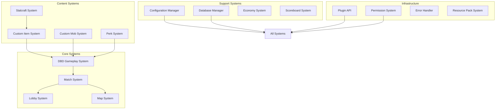

# Design Document: Advanced Dead by Daylight Minecraft Plugin (DBD-AMP)

## Overview

The Advanced Dead by Daylight Minecraft Plugin (DBD-AMP) is a comprehensive Minecraft 1.20.1 plugin that brings the complete Dead by Daylight experience to Minecraft servers. The plugin combines core DBD gameplay mechanics with advanced features from Stalcraft X events, ItemsAdder-like custom items, MythicMobs-like custom mobs, and complete matchmaking systems.

### Design Philosophy

The plugin follows a modular, configuration-driven architecture that separates concerns while maintaining high performance for real-time gameplay. Key design principles include:

1. **Modularity**: Each major system (DBD gameplay, custom items, matchmaking, etc.) is implemented as a separate module with clear interfaces
2. **Configuration-Driven**: All gameplay elements (perks, items, mobs, maps) are defined in YAML/JSON configuration files
3. **Performance-First**: Optimized for Minecraft server performance with asynchronous operations and efficient entity management
4. **Extensibility**: Comprehensive API for other plugins to integrate with DBD systems
5. **Cross-Server Compatibility**: Support for server networks with shared player progression

### Core Architecture

The plugin architecture consists of several interconnected systems:



## Architecture

### System Architecture

The plugin follows a layered architecture with clear separation between:

1. **Presentation Layer**: Minecraft-specific UI, scoreboards, in-game displays
2. **Game Logic Layer**: Core DBD gameplay mechanics, match logic, perk systems
3. **Content Layer**: Custom items, mobs, maps, and configuration definitions
4. **Data Layer**: Database persistence, player progression, statistics
5. **Infrastructure Layer**: Configuration management, error handling, API interfaces

### Technical Stack

- **Minecraft Version**: 1.20.1 (Paper/Spigot API)
- **Programming Language**: Java 17+
- **Build System**: Maven
- **Database**: MySQL (primary), SQLite (fallback)
- **Configuration**: YAML with JSON support
- **Resource Packs**: Custom models/textures with automatic generation
- **Networking**: BungeeCord/Velocity support for cross-server compatibility

### Performance Considerations

1. **Asynchronous Operations**: All database calls, file I/O, and complex calculations run asynchronously
2. **Entity Management**: Efficient tracking of game entities with chunk-based optimization
3. **Event Optimization**: Minimal event handlers with early returns for irrelevant events
4. **Memory Management**: Object pooling for frequently created game objects
5. **Tick Distribution**: Spread CPU-intensive operations across multiple server ticks

## Components and Interfaces

### Core DBD Gameplay System

**Responsibilities**:
- Manage survivor and killer role assignment
- Track generator repair progress and skill checks
- Handle health states, injuries, and healing mechanics
- Implement hook mechanics and sacrifice timers
- Manage exit gates and escape conditions

**Key Interfaces**:
```java
public interface DBDGameplay {
    Match startMatch(Lobby lobby);
    void assignRoles(Match match);
    void handleGeneratorRepair(Player player, Generator generator);
    void handleSurvivorInjury(Player survivor, DamageSource source);
    void handleHookSacrifice(Player survivor, Hook hook);
    MatchResult endMatch(Match match);
}
```

### Match and Lobby System

**Responsibilities**:
- Create and manage match lobbies
- Handle player matchmaking and role selection
- Manage match lifecycle from start to end
- Calculate match results and distribute rewards
- Support different game modes (public, ranked, custom)

**Key Interfaces**:
```java
public interface MatchSystem {
    Lobby createLobby(GameMode mode, Map<String, Object> settings);
    void joinLobby(Player player, Lobby lobby);
    void startMatch(Lobby lobby);
    void endMatch(Match match);
    MatchResult calculateResults(Match match);
}
```

### Custom Item System (ItemsAdder-like)

**Responsibilities**:
- Create custom items with 3D models and textures
- Manage item properties, tooltips, and special abilities
- Generate resource pack assets automatically
- Handle item events and custom behaviors
- Support item tiers, rarity, and progression

**Key Interfaces**:
```java
public interface CustomItemSystem {
    CustomItem createItem(ItemDefinition definition);
    void registerItemBehavior(CustomItem item, ItemBehavior behavior);
    ResourcePack generateAssets(CustomItem item);
    void distributeResourcePack(Player player);
}
```

### Custom Mob System (MythicMobs-like)

**Responsibilities**:
- Spawn custom mobs with advanced AI
- Implement skill trees and ability cooldowns
- Manage boss mechanics and phases
- Handle custom drop tables and loot distribution
- Support conditional triggers and mob behaviors

**Key Interfaces**:
```java
public interface CustomMobSystem {
    CustomMob spawnMob(MobDefinition definition, Location location);
    void registerMobSkill(CustomMob mob, MobSkill skill);
    void handleMobDeath(CustomMob mob, Player killer);
    List<ItemStack> generateLoot(CustomMob mob, LootTable table);
}
```

### Perk System

**Responsibilities**:
- Manage perk unlocking and tier progression
- Handle perk activation conditions and triggers
- Implement survivor and killer perk categories
- Support perk combinations and synergies
- Track perk usage statistics

**Key Interfaces**:
```java
public interface PerkSystem {
    void unlockPerk(Player player, Perk perk);
    void upgradePerk(Player player, Perk perk, int tier);
    boolean checkActivation(Player player, Perk perk, GameEvent event);
    void applyPerkEffect(Player player, Perk perk, GameEvent event);
}
```

### Configuration Management System

**Responsibilities**:
- Load and validate YAML/JSON configuration files
- Detect configuration changes and hot-reload modules
- Provide configuration validation with helpful error messages
- Support configuration inheritance and references
- Maintain configuration consistency across modules

**Key Interfaces**:
```java
public interface ConfigurationManager {
    <T> T loadConfig(String path, Class<T> type);
    void saveConfig(String path, Object config);
    void watchConfig(String path, ConfigChangeListener listener);
    ValidationResult validateConfig(String path, Object config);
}
```

### Database Management System

**Responsibilities**:
- Provide database abstraction with connection pooling
- Support MySQL and SQLite backends
- Implement data migration and versioning
- Handle database errors with retry logic
- Ensure data consistency and integrity

**Key Interfaces**:
```java
public interface DatabaseManager {
    Connection getConnection() throws SQLException;
    void executeTransaction(Transaction transaction);
    <T> T query(String sql, ResultSetMapper<T> mapper, Object... params);
    int update(String sql, Object... params);
    void migrate(SchemaVersion from, SchemaVersion to);
}
```

## Data Models

### Match Data Model

```java
public class Match {
    private UUID matchId;
    private GameMode gameMode;
    private Map<UUID, PlayerRole> players;
    private MapState mapState;
    private MatchStatus status;
    private Instant startTime;
    private Instant endTime;
    private MatchSettings settings;
    
    // Generators, hooks, exit gates
    private List<Generator> generators;
    private List<Hook> hooks;
    private List<ExitGate> exitGates;
    
    // Statistics
    private MatchStatistics statistics;
}

public enum PlayerRole {
    SURVIVOR,
    KILLER
}

public enum MatchStatus {
    LOBBY,
    STARTING,
    IN_PROGRESS,
    ENDING,
    COMPLETED
}
```

### Player Progression Model

```java
public class PlayerProfile {
    private UUID playerId;
    private String username;
    private PlayerLevel level;
    private PrestigeRank prestige;
    private Bloodpoints balance;
    private Map<Perk, PerkProgress> perkProgress;
    private PlayerStatistics statistics;
    private List<Unlockable> unlockedContent;
}

public class PlayerLevel {
    private int level;
    private int experience;
    private int experienceToNext;
    private List<LevelReward> rewards;
}

public class PerkProgress {
    private Perk perk;
    private int tier; // 1-3
    private boolean unlocked;
    private Instant unlockTime;
}
```

### Custom Item Model

```java
public class CustomItem {
    private String itemId;
    private String displayName;
    private ItemType type;
    private CustomModel model;
    private List<String> lore;
    private Map<String, Object> properties;
    private ItemRarity rarity;
    private List<ItemAbility> abilities;
    private DurabilitySettings durability;
}

public class CustomModel {
    private String modelPath;
    private String texturePath;
    private ModelType type; // BLOCK, ITEM, ENTITY
    private Vector3f scale;
    private Vector3f rotation;
    private boolean animated;
}
```

### Custom Mob Model

```java
public class CustomMob {
    private String mobId;
    private EntityType baseType;
    private MobAttributes attributes;
    private List<MobSkill> skills;
    private AIBehavior behavior;
    private LootTable lootTable;
    private BossMechanics bossMechanics;
}

public class MobSkill {
    private String skillId;
    private SkillType type;
    private int cooldown;
    private double range;
    private List<SkillEffect> effects;
    private Condition activationCondition;
}

public class BossMechanics {
    private List<BossPhase> phases;
    private int enrageTimer;
    private List<SpecialAttack> specialAttacks;
    private Map<String, Object> phaseTriggers;
}
```

### Configuration Model

```java
public class PluginConfig {
    private DatabaseConfig database;
    private GameplayConfig gameplay;
    private EconomyConfig economy;
    private MatchmakingConfig matchmaking;
    private PerformanceConfig performance;
    private List<ModuleConfig> modules;
}

public class PerkConfig {
    private Map<String, PerkDefinition> perks;
    private UnlockRequirements unlockRequirements;
    private TierProgression tierProgression;
}

public class MapConfig {
    private List<MapTemplate> templates;
    private GenerationSettings generation;
    private BalanceSettings balance;
    private RotationSettings rotation;
}
```

### Resource Pack Model

```java
public class ResourcePackConfig {
    private String packName;
    private String packDescription;
    private int packFormat;
    private Map<String, ModelDefinition> models;
    private Map<String, TextureDefinition> textures;
    private Map<String, SoundDefinition> sounds;
    private CompressionSettings compression;
    private DistributionSettings distribution;
}
```

## Correctness Properties

*A property is a characteristic or behavior that should hold true across all valid executions of a system—essentially, a formal statement about what the system should do. Properties serve as the bridge between human-readable specifications and machine-verifiable correctness guarantees.*


### Property 1: Configuration Serialization Round-Trip

*For any* valid configuration object (perks, items, mobs, maps, plugin settings), serializing then deserializing the configuration SHALL produce an equivalent configuration object with all properties preserved.

**Validates: Requirements 4.5, 6.5, 8.5, 9.5, 16.4**

### Property 2: Deterministic Map Generation

*For any* valid map configuration and seed value, generating a map layout, saving it, then regenerating with the same seed SHALL produce an identical layout with all objects in the same positions.

**Validates: Requirements 6.5**

### Property 3: Deterministic Statistical Calculations

*For any* set of input match data and player statistics, performing statistical calculations SHALL always produce the same output values, regardless of calculation order or timing.

**Validates: Requirements 12.5**

### Property 4: Database Operation Consistency

*For any* database operation sequence, reading data, writing modified data, then reading again SHALL return the written data (read-your-writes consistency).

**Validates: Requirements 15.5**

### Property 5: Match State Transitions

*For any* valid match state and player action, applying the game rules SHALL produce a new valid match state where:
- Generator repair progress accumulates correctly based on skill check outcomes
- Health states transition appropriately (healthy → injured → dying) based on damage
- Hook sacrifice timers progress and can be interrupted by rescues
- Exit gates open when the required number of generators are completed
- Matches end when all survivors have escaped or been sacrificed

**Validates: Requirements 1.2, 1.3, 1.4, 1.5, 1.6**

### Property 6: Role Assignment Balance

*For any* set of players joining a match, the role assignment system SHALL ensure:
- Exactly one killer is assigned (for standard 1v4 matches)
- Remaining players are assigned as survivors
- Custom game modes respect configured role ratios
- Role selection preferences are considered when possible

**Validates: Requirements 1.1, 5.4**

### Property 7: Movement and Interaction Mechanics

*For any* player in survivor role, movement and interaction mechanics SHALL apply correctly:
- Sprinting, crouching, and vaulting provide appropriate speed modifiers
- Injury states apply movement speed penalties
- Locker hiding prevents detection within terror radius
- Pallet dropping creates obstacles that can be broken by killers
- Skill checks appear with frequency and timing matching configuration

**Validates: Requirements 2.1, 2.2, 2.4, 2.5**

### Property 8: Killer Combat Mechanics

*For any* player in killer role, combat mechanics SHALL apply correctly:
- Basic and lunge attacks apply damage with appropriate cooldowns
- Bloodlust effects accumulate with consecutive hits
- Special powers activate according to killer type and cooldowns
- Pallets can be broken with appropriate animation time
- Carried survivors impose movement penalties and can struggle free

**Validates: Requirements 3.1, 3.2, 3.3, 3.4, 3.5**

### Property 9: Perk System Functionality

*For any* player with unlocked perks, the perk system SHALL:
- Unlock new perk slots at appropriate level thresholds
- Apply tiered effectiveness (levels 1-3) correctly
- Monitor gameplay events for perk activation conditions
- Apply survivor and killer perk effects appropriately for each role
- Track perk usage statistics accurately

**Validates: Requirements 4.1, 4.2, 4.3, 4.4**

### Property 10: Matchmaking and Lobby Management

*For any* players using matchmaking, the system SHALL:
- Create lobbies with specified settings (password, game mode, etc.)
- Allow players to join available lobbies matching preferences
- Automatically start matches when lobby reaches minimum player count
- Implement ready checks before match start
- Support different game modes (public, ranked, custom) with appropriate rules

**Validates: Requirements 5.1, 5.2, 5.3, 5.4, 5.6**

### Property 11: Map Generation and Balance

*For any* map generation request, the system SHALL:
- Place generators, hooks, chests, and exit gates in balanced positions
- Apply procedural generation within template constraints
- Use appropriate blocks and textures for selected themes
- Support map rotation and voting systems fairly
- Ensure minimum distances between objectives for gameplay balance

**Validates: Requirements 6.1, 6.2, 6.3, 6.4**

### Property 12: Stalcraft Event Features

*For any* weapon case spawning event, the system SHALL:
- Place cases with correct custom models and rarity tiers
- Implement opening mechanics requiring appropriate keys
- Distribute rewards according to configured probability tables
- Create custom weapons with unique stats and abilities as defined
- Track event currency separately from main economy

**Validates: Requirements 7.1, 7.2, 7.3, 7.5**

### Property 13: Custom Item Creation

*For any* custom item definition, the system SHALL:
- Create items with specified 3D models, textures, and properties
- Apply custom tooltips, lore, enchantment glows, and durability
- Register appropriate event handlers for special abilities
- Generate resource pack assets automatically
- Ensure items function correctly in gameplay

**Validates: Requirements 8.1, 8.2, 8.3, 8.4**

### Property 14: Custom Mob Behavior

*For any* custom mob definition, the system SHALL:
- Spawn mobs with specified attributes, skills, and AI behavior
- Implement skill trees with cooldowns and conditional triggers
- Apply weighted drop tables for custom loot
- Support boss mechanics including phases and enrage timers
- Ensure mobs behave according to their AI configuration

**Validates: Requirements 9.1, 9.2, 9.3, 9.4**

### Property 15: Real-time Scoreboard Updates

*For any* active match state change, the scoreboard system SHALL:
- Display current generator progress, survivor status, and match timer
- Trigger animations for important events (generator completed, survivor hooked)
- Update player information in real-time
- Show appropriate layouts for survivors vs. killers
- Display post-game statistics and rewards when match ends

**Validates: Requirements 10.1, 10.2, 10.3, 10.4, 10.5**

### Property 16: Economy and Progression Systems

*For any* player completing matches or making transactions, the system SHALL:
- Award bloodpoints based on performance metrics
- Track player levels, prestige ranks, and experience accurately
- Process shop purchases correctly (perks, cosmetics, items)
- Record comprehensive player statistics (escape rate, kills, repairs, etc.)
- Handle prestige resets with appropriate reward granting

**Validates: Requirements 11.1, 11.2, 11.3, 11.4, 11.5**

### Property 17: Statistics and Leaderboard Accuracy

*For any* match results and player performance data, the system SHALL:
- Record all match results, player performance, and historical data
- Calculate leaderboard rankings correctly for all categories
- Update leaderboards in real-time as matches complete
- Provide accurate personal statistics with trend analysis
- Maintain data integrity across all statistical operations

**Validates: Requirements 12.1, 12.2, 12.3, 12.4**

### Property 18: Configuration Management Reliability

*For any* configuration file operations, the system SHALL:
- Detect file changes and reload affected modules
- Validate configuration syntax with helpful error messages
- Resolve file references correctly
- Support selective reloading of configuration sections
- Rollback to previous state on reload failure with administrator notification

**Validates: Requirements 16.1, 16.2, 16.3, 22.1, 22.2, 22.3, 22.4**

### Property 19: Error Handling and Recovery

*For any* error condition during gameplay, the system SHALL:
- Log errors with comprehensive match context and player information
- Prevent match crashes by catching exceptions and continuing with degraded functionality
- Attempt automatic recovery for recoverable errors
- Support different log levels and formats with match ID correlation
- Provide helpful suggestions when common player mistakes are detected

**Validates: Requirements 21.1, 21.2, 21.3, 21.4, 24.4**

### Property 20: Performance and Scalability

*For any* system operation, the DBD-AMP SHALL:
- Use asynchronous operations for I/O, database calls, and calculations
- Spread CPU-intensive operations across multiple server ticks
- Trigger garbage collection when memory usage exceeds thresholds
- Implement efficient entity tracking for large matches
- Maintain responsive gameplay even under load

**Validates: Requirements 20.1, 20.2, 20.4, 20.5**

### Property 21: Multi-Server Data Integrity

*For any* multi-server environment with shared database, the system SHALL:
- Synchronize player data, progression, and statistics across servers
- Transfer player progression and inventory correctly during server switches
- Prevent data corruption and conflicts from concurrent operations
- Maintain data consistency across all server instances

**Validates: Requirements 23.1, 23.3, 23.4**

### Property 22: API and Permission System Correctness

*For any* API call or permission check, the system SHALL:
- Validate permissions and parameters for all API methods
- Provide asynchronous alternatives for performance-sensitive operations
- Support event hooks for custom behavior injection
- Evaluate permission checks against configured roles and inheritance
- Apply the most restrictive setting for conflicting permissions

**Validates: Requirements 17.2, 17.3, 17.4, 18.1, 18.2, 18.3**

## Error Handling

### Error Classification

The DBD-AMP implements a comprehensive error handling strategy with three error categories:

1. **Recoverable Errors**: Configuration parsing errors, database connection issues, invalid player input
   - Strategy: Automatic retry with exponential backoff, fallback to default values, user notification
   
2. **Gameplay Errors**: Skill check failures, invalid game state transitions, balance violations
   - Strategy: Graceful degradation, match state correction, player feedback
   
3. **Fatal Errors**: Memory exhaustion, critical database corruption, unrecoverable system errors
   - Strategy: Safe match termination, comprehensive logging, administrator alerting

### Error Recovery Patterns

1. **Retry with Backoff**: For transient errors (database timeouts, network issues)
2. **Fallback to Defaults**: For configuration errors, use safe default values
3. **State Rollback**: For gameplay errors, revert to last valid match state
4. **Degraded Functionality**: Continue with reduced features when non-critical components fail
5. **Safe Termination**: End matches cleanly when recovery is impossible

### Error Logging and Monitoring

- **Structured Logging**: JSON-formatted logs with match IDs, player UUIDs, and error contexts
- **Log Levels**: DEBUG, INFO, WARN, ERROR, FATAL with appropriate filtering
- **Real-time Monitoring**: Performance metrics, error rates, match completion statistics
- **Alerting**: Administrator notifications for critical errors via in-game and external channels
- **Audit Trail**: Complete record of administrative actions and system changes

## Testing Strategy

### Dual Testing Approach

The DBD-AMP employs a comprehensive testing strategy combining:

1. **Property-Based Tests (PBT)**: Verify universal properties across generated inputs
2. **Example-Based Unit Tests**: Test specific scenarios, edge cases, and integration points
3. **Integration Tests**: Verify external system compatibility (databases, permission plugins)
4. **Performance Tests**: Ensure scalability and responsiveness under load
5. **User Acceptance Tests**: Validate gameplay experience and user interface

### Property-Based Testing Implementation

**Library Selection**: JUnit QuickCheck for Java property-based testing

**Test Configuration**:
- Minimum 100 iterations per property test
- Custom generators for DBD-specific data structures
- Shrinking support for debugging failing cases
- Tag-based test organization for parallel execution

**Property Test Examples**:
```java
@Property(trials = 100)
public void configurationRoundTrip(@ForAll PerkConfig config) {
    String serialized = serialize(config);
    PerkConfig deserialized = deserialize(serialized);
    assertEquals(config, deserialized);
}

@Property(trials = 100) 
public void matchStateTransitions(@ForAll MatchState state, @ForAll PlayerAction action) {
    MatchState newState = applyGameRules(state, action);
    assertTrue(isValidMatchState(newState));
}
```

### Unit Testing Strategy

**Test Categories**:
1. **Game Logic Tests**: Core DBD mechanics, perk activation, skill checks
2. **Data Model Tests**: Serialization, validation, transformation logic
3. **Configuration Tests**: Loading, validation, hot-reload functionality
4. **API Tests**: Interface contracts, parameter validation, permission checks
5. **Utility Tests**: Helper functions, mathematical calculations, data structures

**Test Organization**:
- Follow Arrange-Act-Assert pattern
- Use meaningful test names describing the scenario
- Isolate tests with appropriate mocking
- Maintain high test coverage for critical paths

### Integration Testing

**External System Integration**:
1. **Database Tests**: MySQL and SQLite connectivity, migration scripts
2. **Permission Plugin Tests**: LuckPerms, PermissionsEx compatibility
3. **Server Software Tests**: Paper 1.20.1, Spigot compatibility
4. **Proxy Tests**: BungeeCord, Velocity network support
5. **Resource Pack Tests**: Client compatibility, distribution mechanisms

**Integration Test Environment**:
- Docker containers for isolated testing
- Mock servers for external dependencies
- Test databases with sample data
- Automated setup and teardown scripts

### Performance Testing

**Load Testing Scenarios**:
1. **Single Match Performance**: Response times for 1v4 matches
2. **Concurrent Matches**: Multiple simultaneous matches on same server
3. **Large Player Counts**: Stress testing with many connected players
4. **Database Performance**: Read/write operations under load
5. **Memory Usage**: Garbage collection patterns and memory leaks

**Performance Metrics**:
- **Response Time**: Game action to server response latency
- **Throughput**: Matches completed per hour
- **Resource Usage**: CPU, memory, disk I/O, network bandwidth
- **Scalability**: Performance degradation with increasing load
- **Stability**: System behavior under sustained operation

### Test Automation and CI/CD

**Continuous Integration Pipeline**:
1. **Code Quality**: Static analysis, code style checks, dependency scanning
2. **Unit Tests**: Fast-running tests on every commit
3. **Property Tests**: Longer-running property tests on main branch
4. **Integration Tests**: External system tests on dedicated environment
5. **Performance Tests**: Scheduled performance regression testing

**Test Reporting**:
- Detailed test reports with failure analysis
- Code coverage metrics (aim for 80%+ on critical paths)
- Performance regression alerts
- Test flakiness detection and reporting

### Manual Testing and User Acceptance

**Testing Checklists**:
1. **Gameplay Flow**: Match creation, role assignment, objective completion, match end
2. **User Interface**: Scoreboards, menus, chat commands, help system
3. **Administration**: Configuration management, player management, server commands
4. **Content Creation**: Custom items, mobs, maps, resource packs
5. **Multi-Server**: Cross-server progression, data synchronization

**Beta Testing Program**:
- Early access for community testers
- Feedback collection and bug reporting
- Balance testing and gameplay tuning
- Documentation verification and improvement

### Test Data Management

**Test Data Generation**:
- Property-based test generators for all data models
- Sample configurations for all plugin features
- Realistic player progression data
- Edge case scenarios (empty data, maximum values, special characters)

**Test Data Isolation**:
- Separate test databases from production
- Clean test environment setup for each test run
- Data anonymization for player information
- Test data versioning alongside code changes